<div align="center">

# FastAPI Monitoring & Observability

**Production-ready FastAPI observability — metrics, logs, and traces fully correlated via OpenTelemetry and the LGTM stack**


</div>

---

## 📋 Table of Contents

- [FastAPI Monitoring \& Observability](#fastapi-monitoring--observability)
  - [📋 Table of Contents](#-table-of-contents)
  - [📖 Overview](#-overview)
  - [🏗️ Architecture](#️-architecture)
  - [📦 Prerequisites](#-prerequisites)
  - [🚀 Quick Start](#-quick-start)
    - [🐳 Option A — Full Docker Stack (Recommended)](#-option-a--full-docker-stack-recommended)
    - [💻 Option B — Local Development](#-option-b--local-development)
    - [🚦 Generate traffic](#-generate-traffic)
  - [📁 Project Structure](#-project-structure)
  - [⚙️ Configuration](#️-configuration)
  - [🔌 API Endpoints](#-api-endpoints)
  - [🔭 Observability Stack](#-observability-stack)
    - [📊 Metrics — Prometheus](#-metrics--prometheus)
    - [📝 Logs — Loki](#-logs--loki)
    - [🔍 Traces — Tempo](#-traces--tempo)
    - [📈 Dashboards — Grafana](#-dashboards--grafana)
    - [💬 Example Queries](#-example-queries)
  - [🔗 How Correlation Works](#-how-correlation-works)
  - [📜 Make Reference](#-make-reference)
  - [🔧 Troubleshooting](#-troubleshooting)
    - [Telemetry not appearing in Grafana](#telemetry-not-appearing-in-grafana)
    - [Containers fail to start](#containers-fail-to-start)
    - [App starts but reports no telemetry](#app-starts-but-reports-no-telemetry)
  - [📚 Further Reading](#-further-reading)
  - [🤝 Feedback \& Contributing](#-feedback--contributing)
  - [📄 License](#-license)

---

## 📖 Overview

Built to explore production-grade observability patterns in Python — specifically how to connect the three pillars (metrics, logs, traces) into a single correlated signal without vendor lock-in. The goal was to understand how OpenTelemetry, the LGTM stack, and Grafana's cross-datasource linking work together end-to-end in a realistic service.

This project is a **self-contained, fully observable FastAPI service** wired to the **LGTM stack** (Loki, Grafana, Tempo, Prometheus) via a single OpenTelemetry Collector. Every request produces correlated logs, metrics, and traces — so you can jump from a Grafana dashboard panel straight to the trace, and from the trace directly to the matching log lines, without any manual ID copying.

- **Structured logging** — Loguru enriches every log record with `trace_id` and `span_id`; JSON format in production, human-readable text in development.
- **Metrics** — `MetricsMiddleware` records request count, latency histogram, and in-flight gauge using the OTel SDK; Prometheus scrapes the Collector's exporter endpoint.
- **Distributed tracing** — `FastAPIInstrumentor` and `HTTPXClientInstrumentor` produce automatic spans; manual child spans are added for background tasks and nested calls.
- **Trace ↔ log correlation** — `trace_id` is a Loki index label and a Prometheus exemplar field, enabling one-click navigation between all three signals in Grafana.
- **Pre-built Grafana dashboard** — auto-provisioned on first start; tracks the four golden signals (latency, traffic, error rate, saturation) with drill-down to traces and logs.
- **One-command setup** — `make docker-up` starts the full stack (app + all backends + Grafana) with no manual configuration.

---

## 🏗️ Architecture

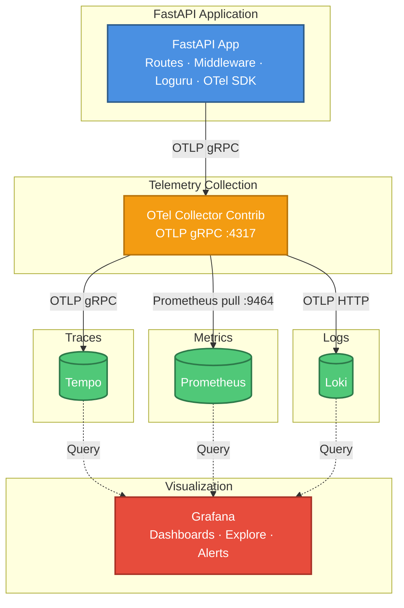

---

## 📦 Prerequisites

| Tool              | Version                   | Install                                                                                          |
| ----------------- | ------------------------- | ------------------------------------------------------------------------------------------------ |
| Python            | 3.13+                     | [python.org](https://www.python.org/downloads/)                                                  |
| uv                | latest                    | `pip install uv` or [docs.astral.sh/uv](https://docs.astral.sh/uv/getting-started/installation/) |
| Docker Desktop    | 4.x+                      | [docker.com](https://www.docker.com/products/docker-desktop/)                                    |
| Docker Compose    | v2 (bundled with Desktop) | —                                                                                                |
| Make *(optional)* | any                       | macOS: `brew install make` · Windows: `winget install GnuWin32.Make` · Linux: pre-installed      |

> **Make is optional** — every `make <target>` is a shortcut for a plain shell command. See the [Make Reference](#-make-reference) for the underlying commands you can run directly (e.g. `uv run uvicorn app.main:app --reload` instead of `make dev`).

---

## 🚀 Quick Start

### 🐳 Option A — Full Docker Stack (Recommended)

This starts the FastAPI app **and** the entire observability infrastructure in one command.

```bash
git clone https://github.com/mouakos/fastapi-monitoring-observability.git
cd fastapi-monitoring-observability

make docker-up
```

Wait ~15 seconds for all containers to initialise, then open:

| Service            | URL                        | Credentials   |
| ------------------ | -------------------------- | ------------- |
| FastAPI Swagger UI | http://localhost:8000/docs | —             |
| Grafana            | http://localhost:3000      | admin / admin |
| Prometheus         | http://localhost:9090      | —             |
| Loki (raw)         | http://localhost:3100      | —             |
| Tempo (raw)        | http://localhost:3200      | —             |

> **Docker stack overview**
> 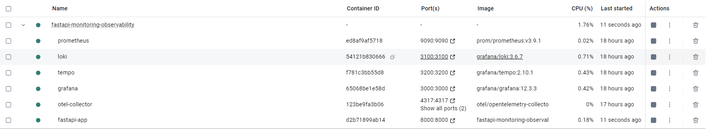
> *All containers running after `make docker-up`. Visible in Docker Desktop.*

> To stop containers or delete volumes, see [`make docker-down` / `make docker-purge`](#-make-reference) in the Make Reference.

---

### 💻 Option B — Local Development

Use this when you want hot-reload during development while the observability stack runs in Docker.

**Step 1 — Install**

```bash
make install
```

**Step 2 — Create a `.env` file**

```bash
# macOS / Linux
cp .env.template .env

# Windows (PowerShell)
Copy-Item .env.template .env
```

Minimum `.env` for local development with Docker-hosted collector:

```env
OTEL_ENABLED=true
OTEL_EXPORTER_OTLP_ENDPOINT=localhost:4317
OTEL_EXPORTER_OTLP_INSECURE=true
OTEL_SERVICE_NAME=fastapi-app
LOG_LEVEL=DEBUG
ENVIRONMENT=development
```

> When `OTEL_ENABLED=false`, the app starts without any telemetry export — useful for pure local testing.

**Step 3 — Start the observability stack only**

```bash
# Start all infra containers except fastapi-app
docker compose up -d loki tempo prometheus otel-collector grafana
```

**Step 4 — Run the app with hot reload**

```bash
make dev
# or directly:
uv run uvicorn app.main:app --reload
```

The app is now available at http://localhost:8000/docs.

---

### 🚦 Generate traffic

Once the stack is running, run the traffic script to populate the Grafana dashboards:

```bash
# Default: 50 requests with random jitter
uv run python scripts/generate_traffic.py

# Custom round count
uv run python scripts/generate_traffic.py --rounds 100

# Run continuously for 60 seconds
uv run python scripts/generate_traffic.py --duration 60
```

The script hits every endpoint with realistic weights — `/random-status` fires most often (error rate signal), `/slow` at three delays (latency distribution), `/crash` occasionally (exception traces), and `/chain`, `/trace-nested`, `/background-task` for distributed trace scenarios.

Open Grafana at http://localhost:3000, navigate to **Dashboards → FastAPI Observability**, and request rate, latency, error rate, and live traces should appear within a few seconds.

---

## 📁 Project Structure

```
fastapi-monitoring-observability/
│
├── app/                          # Application source code
│   ├── main.py                   # FastAPI app factory, lifespan, middleware registration
│   ├── api.py                    # All API route handlers (observability test endpoints)
│   ├── settings.py               # Pydantic Settings — config from env / .env
│   ├── otel.py                   # OTel SDK setup: traces, metrics, logs
│   ├── logging.py                # Loguru setup, patcher registry, stdlib bridge
│   ├── exceptions.py             # Global exception handlers
│   ├── context.py                # ContextVar helpers
│   ├── utils.py                  # Shared utilities (route path extraction, etc.)
│   └── middleware/
│       ├── logging.py            # RequestLoggingMiddleware — structured access logs
│       └── metrics.py            # MetricsMiddleware — OTel counter, histogram, gauge
│
├── docker/                       # Observability stack configuration
│   ├── otel-collector-config.yml # OTel Collector pipeline (receivers, processors, exporters)
│   ├── loki-config.yml           # Loki storage + OTLP ingestion config
│   ├── tempo-config.yml          # Tempo trace storage config
│   ├── prometheus-config.yml     # Prometheus scrape config
│   └── grafana/
│       └── provisioning/
│           ├── dashboards/       # Auto-provisioned dashboard JSON
│           └── datasources/      # Auto-provisioned Prometheus, Loki, Tempo datasources
│
├── docs/
│   └── images/                   # Screenshot for README
│
├── logs/                         # Local log files (when LOG_TO_FILE=true)
├── .env.template                 # Copy to .env — all configurable variables with defaults
├── .env                          # Local overrides (git-ignored)
├── .gitignore
├── .pre-commit-config.yaml       # Pre-commit hooks (Ruff, Mypy)
├── .python-version               # Pins Python 3.13 for pyenv / uv
├── docker-compose.yml            # Full stack definition
├── Dockerfile                    # Production image (python:3.13-slim + uv)
├── pyproject.toml                # Dependencies, Ruff, Mypy config
├── uv.lock                       # Locked dependency versions
├── Makefile                      # Developer shortcuts
├── LICENSE
└── README.md
```

---

## ⚙️ Configuration

All settings are defined in `app/settings.py` using Pydantic Settings. Values are read from environment variables or a `.env` file (case-insensitive).

| Variable                      | Default          | Description                                                       |
| ----------------------------- | ---------------- | ----------------------------------------------------------------- |
| `LOG_LEVEL`                   | `INFO`           | Loguru log level: `DEBUG`, `INFO`, `WARNING`, `ERROR`, `CRITICAL` |
| `LOG_SERIALIZED`              | `false`          | Emit logs as JSON (enabled automatically inside Docker)           |
| `LOG_TO_FILE`                 | `false`          | Write rotating log file to `logs/`                                |
| `API_VERSION`                 | `1.0.0`          | Semver string embedded in `/info` response                        |
| `ENVIRONMENT`                 | `development`    | `development` / `staging` / `production`                          |
| `OTEL_ENABLED`                | `false`          | Master switch for all OTLP exporters                              |
| `OTEL_SERVICE_NAME`           | `fastapi-app`    | Service name tag on all telemetry signals                         |
| `OTEL_EXPORTER_OTLP_ENDPOINT` | `localhost:4317` | gRPC endpoint of the OTel Collector                               |
| `OTEL_EXPORTER_OTLP_INSECURE` | `true`           | Disable TLS for the gRPC connection                               |
| `OTEL_METRIC_EXPORT_INTERVAL` | `5000`           | Metric push interval in milliseconds                              |

---

## 🔌 API Endpoints

All endpoints are reachable at `http://localhost:8000` and documented in Swagger at `/docs`.

> **Swagger UI**
> 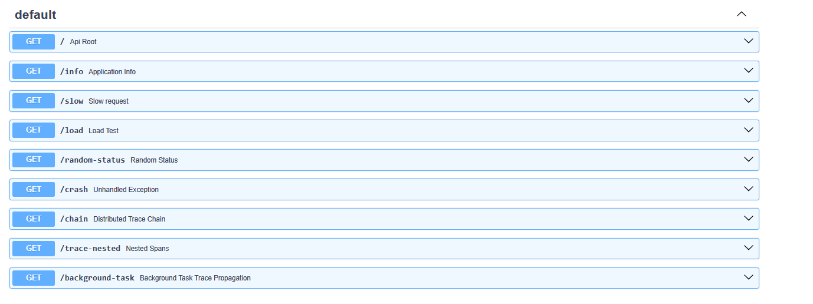
> *Interactive API documentation at http://localhost:8000/docs.*

| Method | Path               | Purpose                                               | What to verify in Grafana                        |
| ------ | ------------------ | ----------------------------------------------------- | ------------------------------------------------ |
| `GET`  | `/info`            | Service version and environment                       | —                                                |
| `GET`  | `/slow?delay=2.0`  | Simulate high-latency response                        | Duration histogram spike in Prometheus           |
| `GET`  | `/random-status`   | Returns random 2xx / 4xx / 5xx                        | Error rate tracking in Grafana                   |
| `GET`  | `/crash`           | Triggers an unhandled `ZeroDivisionError`             | Exception log + 500 trace in Tempo               |
| `GET`  | `/chain`           | Two sequential HTTPX outbound calls                   | Full distributed trace with child spans in Tempo |
| `GET`  | `/trace-nested`    | Two manual child spans                                | Parent-child span hierarchy in Tempo             |
| `GET`  | `/background-task` | Enqueued background task with propagated OTel context | Background span linked to request span in Tempo  |

**Try a request:**

```bash
curl http://localhost:8000/slow?delay=1
curl http://localhost:8000/random-status
curl http://localhost:8000/chain
```

> Use `scripts/generate_traffic.py` to send a realistic burst across all endpoints — see [Generate traffic](#-generate-traffic) in the Quick Start.

---

## 🔭 Observability Stack

### 📊 Metrics — Prometheus

`MetricsMiddleware` wraps every request and records three OTel instruments. The OTel SDK pushes metric data to the Collector on a configurable interval (`OTEL_METRIC_EXPORT_INTERVAL`, default 5 s). The Collector exposes a Prometheus exporter endpoint that Prometheus scrapes on a pull basis.

Metrics pipeline:

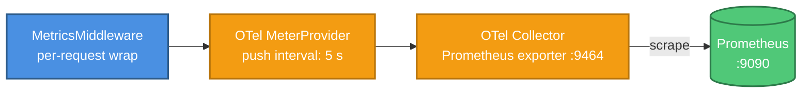

**Custom metrics** recorded by `MetricsMiddleware`:

| Metric                          | Type      | Labels                                         | When recorded                          |
| ------------------------------- | --------- | ---------------------------------------------- | -------------------------------------- |
| `otel_http_request_count_total` | Counter   | `http_method`, `http_path`, `http_status_code` | Incremented once per completed request |
| `otel_http_request_duration_ms` | Histogram | `http_method`, `http_path`, `http_status_code` | Observed with response time in ms      |
| `otel_http_request_in_progress` | Gauge     | `http_method`, `http_path`                     | +1 on request start, −1 on request end |

- The `http_path` label uses the **FastAPI route template** (e.g. `/slow`, `/chain`), not the raw URL, to keep label cardinality low and avoid a Prometheus series explosion.
- The `otel_` prefix is set via `namespace: "otel"` in the OTel Collector's Prometheus exporter config (`docker/otel-collector-config.yml`).
- **Exemplars** are attached to the histogram when `OTEL_ENABLED=true`. Prometheus must be started with `--enable-feature=exemplar-storage` (already set in `docker/prometheus-config.yml`) to store and expose them. Each exemplar carries the `trace_id` of the request that produced that data point.

> **Grafana — PromQL metrics explorer**
> 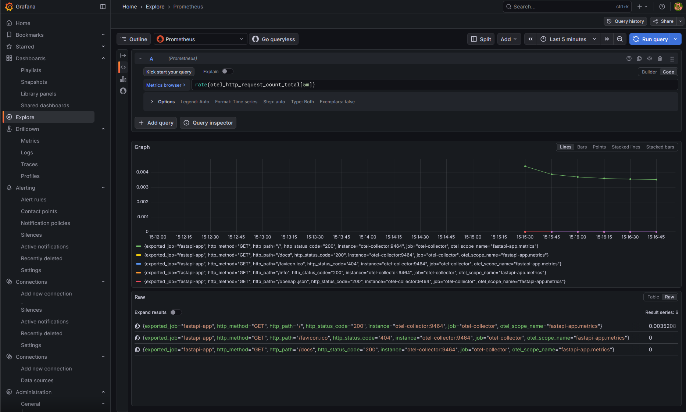
> *Custom FastAPI metrics queried in Grafana Explore using PromQL (http://localhost:3000).*

---

### 📝 Logs — Loki

Structured logs are emitted by **Loguru**, enriched with `trace_id` and `span_id`, then forwarded to **Loki** through the OTel Collector over OTLP HTTP.

Log pipeline:

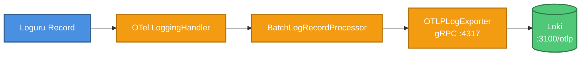

Loki index labels are configured in `docker/loki-config.yml` via `otlp_config.log_attributes` (low-cardinality, fast filter):

| Label                    | Value example   | Source                                           | Note                                                              |
| ------------------------ | --------------- | ------------------------------------------------ | ----------------------------------------------------------------- |
| `service_name`           | `fastapi-app`   | `service.name` OTel resource attribute           | Loki default — dots converted to underscores                      |
| `deployment_environment` | `development`   | `deployment.environment` OTel resource attribute | Loki default — dots converted to underscores                      |
| `level`                  | `INFO`          | `severity_text` OTLP field                       | Copied to log attribute by OTel Collector `transform/logs`        |
| `trace_id`               | `4bf92f3577b3…` | `extra.trace_id` Loguru field                    | Lifted from nested `extra` map by OTel Collector `transform/logs` |
| `version`                | `1.0.0`         | `extra.version` Loguru field                     | Lifted from nested `extra` map by OTel Collector `transform/logs` |

Everything else (message body, `span_id`, `http_method`, `http_path`, `duration_ms`, etc.) is stored as **structured metadata**.

**Sample log record — development (`LOG_SERIALIZED=false`)**:

```
2026-03-03 14:30:01 | INFO     | app.middleware.logging:dispatch:44 | http_request - {'version': '1.0.0', 'environment': 'development', 'http_method': 'GET', 'http_path': '/random-status', 'client_ip': '172.18.0.1', 'http_status_code': 200, 'duration_ms': 0.75, 'trace_id': 'cc6ef9e52e64227252fb90bbc20b9202', 'span_id': 'e8150912c7c7b3b3'}
```

**Sample log record — production (`LOG_SERIALIZED=true`)**:

```json
{
  "text": "2026-03-03 15:27:31 | INFO | app.middleware.logging:dispatch:44 | http_request - {...}",
  "record": {
    "time": {"repr": "2026-03-03 15:27:31.763723+00:00", "timestamp": 1772551651.763723},
    "level": {"name": "INFO", "no": 20},
    "message": "http_request",
    "name": "app.middleware.logging",
    "function": "dispatch",
    "line": 44,
    "extra": {
      "version": "1.0.0",
      "environment": "development",
      "http_method": "GET",
      "http_path": "/random-status",
      "client_ip": "172.18.0.1",
      "user_agent": "Mozilla/5.0 ...",
      "http_status_code": 400,
      "duration_ms": 1.31,
      "trace_id": "208f777a9b3b9daad1f60be1bf944d38",
      "span_id": "c20b939337783778"
    }
  }
}
```

> **Grafana — Loki log explorer**
> 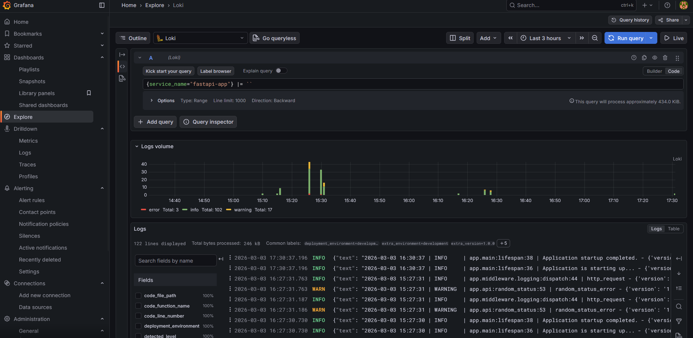
> *Structured logs from the FastAPI service queried in Grafana Explore using LogQL (http://localhost:3000).*

---

### 🔍 Traces — Tempo

Distributed traces are produced by the **OTel Python SDK** using a combination of auto-instrumentation and manual spans. `FastAPIInstrumentor` automatically creates a root HTTP span for every inbound request — capturing method, route, status code, and duration without any code changes. `HTTPXClientInstrumentor` wraps every outbound `httpx` call and injects the W3C `traceparent` header, propagating the trace context to downstream services. For deeper visibility, manual child spans are created in selected handlers (`/trace-nested`, `/background-task`) to represent discrete units of work within a single request.

All spans are batched by `BatchSpanProcessor` and exported to the OTel Collector via OTLP gRPC. The Collector forwards them to **Tempo**, where they are stored on local disk and indexed by `trace_id` — no external index or object storage required (configured in `docker/tempo-config.yml`). Traces are queryable in Grafana using **TraceQL**.

Trace pipeline:

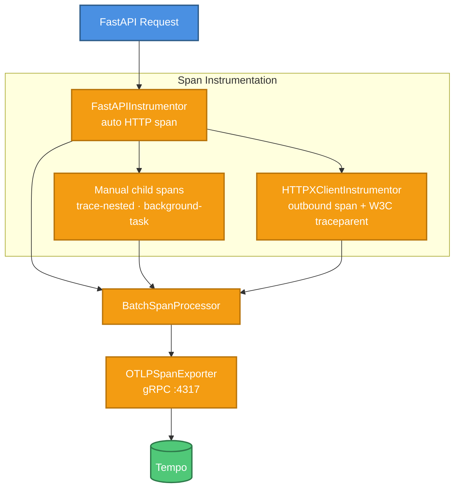

> **Grafana — Tempo trace detail**
> 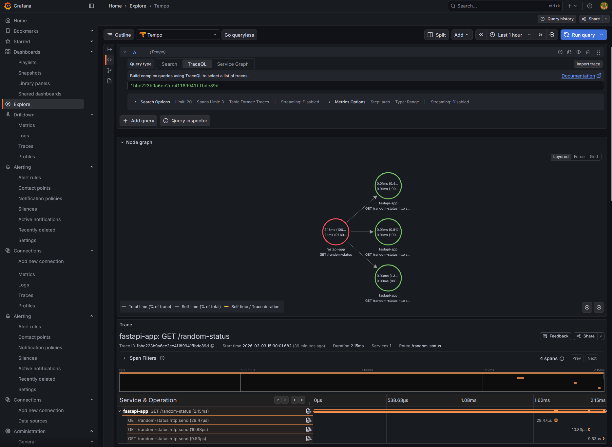
> *Full distributed trace for a request queried in Grafana Explore using TraceQL (http://localhost:3000).*

---

### 📈 Dashboards — Grafana

Grafana is available at **http://localhost:3000** (admin / admin).

Datasources are automatically provisioned on first start from `docker/grafana/provisioning/datasources/datasources.yml`:

| Datasource | UID          | URL                      |
| ---------- | ------------ | ------------------------ |
| Prometheus | `prometheus` | `http://prometheus:9090` |
| Loki       | `loki`       | `http://loki:3100`       |
| Tempo      | `tempo`      | `http://tempo:3200`      |

The project ships a pre-built dashboard: `docker/grafana/provisioning/dashboards/fastapi-observability-dashboard.json`

> **Grafana dashboard overview**
> 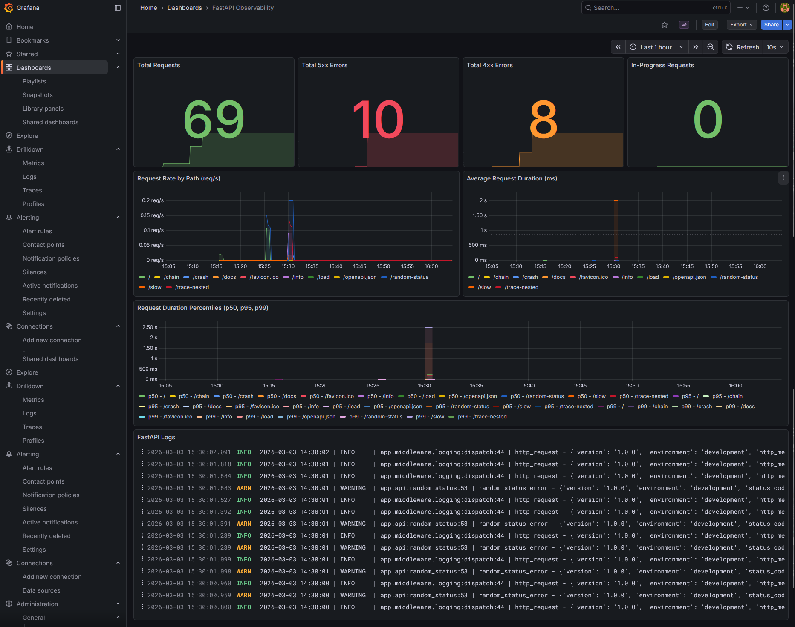
> *Main FastAPI observability dashboard — request rate, error rate, latency, active requests and fastapi-app logs.*

---

### 💬 Example Queries

<details>
<summary><b>📊 PromQL (Prometheus) — Metrics Queries</b></summary>

```promql
# Request rate per second over the last 5 minutes
rate(otel_http_request_count_total[5m])

# 95th percentile latency in milliseconds
histogram_quantile(0.95, rate(otel_http_request_duration_ms_bucket[5m]))

# Error rate percentage (4xx + 5xx)
sum(rate(otel_http_request_count_total{http_status_code=~"[45].."}[5m]))
  / sum(rate(otel_http_request_count_total[5m])) * 100

# Request rate broken down by endpoint
sum by (http_path) (rate(otel_http_request_count_total[5m]))

# Currently in-flight requests
otel_http_request_in_progress

# Top 5 slowest endpoints (p99)
topk(5,
  histogram_quantile(0.99, sum by (http_path, le) (
    rate(otel_http_request_duration_ms_bucket[5m])
  ))
)
```

> See [Metrics — Prometheus](#-metrics--prometheus) for the full label and metric definitions.

</details>

<details>
<summary><b>📝 LogQL (Loki) — Log Queries</b></summary>

```logql
# All logs from the FastAPI app
{service_name="fastapi-app"}

# Error and warning logs only
{service_name="fastapi-app", level=~"WARNING|ERROR"}

# Logs for a specific trace (trace_id is a Loki index label)
{service_name="fastapi-app", trace_id="4bf92f3577b34da6a3ce929d0e0e4736"}

# HTTP request completed logs, parsed as JSON, filtered by slow responses
{service_name="fastapi-app"} | json | message="http_request_completed" | duration_ms > 1000

# Error rate per minute
sum(count_over_time({service_name="fastapi-app", level="ERROR"} [1m]))

# Log volume by level over time
sum by (level) (count_over_time({service_name="fastapi-app"} [1m]))
```

**Label reference:** see the [Loki index labels table](#-logs--loki) in the Logs section for the full list of indexed labels, value examples, and sources.

</details>

<details>
<summary><b>🔍 TraceQL (Tempo) — Trace Queries</b></summary>

```traceql
# All traces
{}

# Slow traces (> 500ms)
{ duration > 500ms }

# Traces for the FastAPI service
{ resource.service.name = "fastapi-app" }

# Traces with errors (unhandled exceptions, 5xx)
{ status = error }

# Traces for a specific HTTP route
{ span.http.route = "/slow" }

# Traces hitting the /chain endpoint that took over 1 second
{ resource.service.name = "fastapi-app" && span.http.route = "/chain" && duration > 1s }

# Traces that include an outbound HTTPX span
{ span.http.url =~ "https://.*" }

# Find the trace for a known trace ID
{ rootSpan.traceID = "4bf92f3577b34da6a3ce929d0e0e4736" }
```

**Key attributes for this project** (not exhaustive — see the [OTel semantic conventions](https://opentelemetry.io/docs/specs/semconv/) for the full list):

- `resource.service.name` — set to `fastapi-app` via the OTel SDK `Resource`
- `span.http.route` — FastAPI route template, set by `FastAPIInstrumentor`
- `span.http.status_code` — HTTP response status code
- `duration` — total span duration (supports `ms`, `s` units)
- `status` — OTel span status: `ok`, `error`, `unset`

</details>

---

## 🔗 How Correlation Works

The three signals are correlated via a single shared identifier — `trace_id` — injected into every log record:

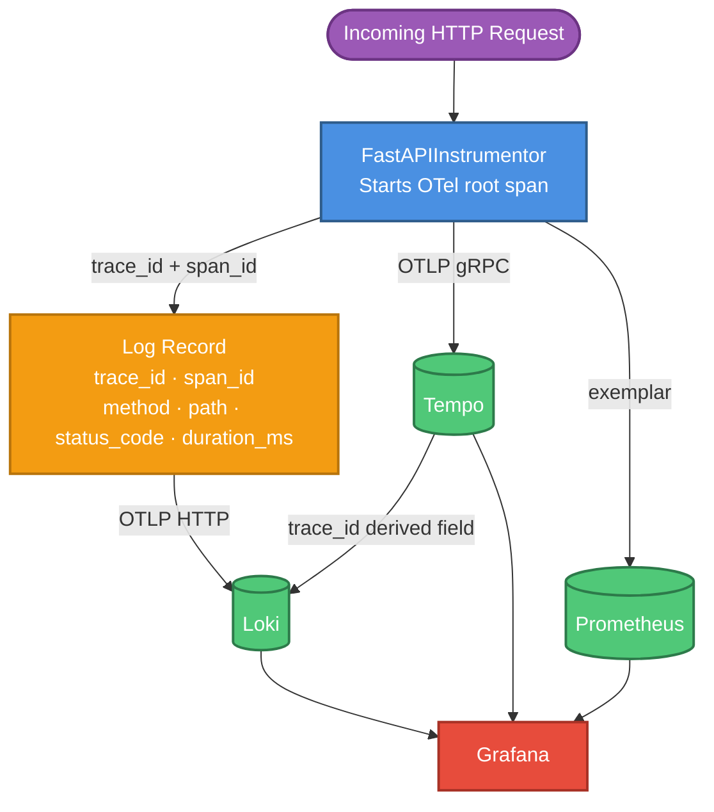

**Correlation walk-through:**

1. `FastAPIInstrumentor` starts an OTel root span and makes `trace_id` and `span_id` available in the active context. Both values are bound into every Loguru log record emitted during that request.
2. If the handler makes an outbound call via `httpx`, `HTTPXClientInstrumentor` injects the W3C `traceparent` header, propagating `trace_id` and `span_id` to the downstream service so the full call chain appears as a single trace.
3. `RequestLoggingMiddleware` emits a log line on completion, carrying `trace_id`, `span_id`, method, path, status code, and duration — all in one record.
4. Every log line is forwarded to Loki with `trace_id` as an indexed label. Every histogram data point is stored in Prometheus with `trace_id` as an **exemplar**. Every span is stored in Tempo indexed by `trace_id`.

The datasource provisioning file (`docker/grafana/provisioning/datasources/datasources.yml`) wires the UI links that make these paths navigable:

| Datasource | Config key                    | What it enables                                                                  |
| ---------- | ----------------------------- | -------------------------------------------------------------------------------- |
| Prometheus | `exemplarTraceIdDestinations` | Clicking an exemplar dot opens the matching trace in Tempo                       |
| Loki       | `derivedFields` (label match) | Extracts `trace_id` from each log line and adds a **Tempo** button               |
| Tempo      | `tracesToLogsV2`              | The **Logs for this span** button jumps to matching Loki log lines by `trace_id` |

**Navigation in Grafana — all three paths:**

> **Logs → Trace**
> 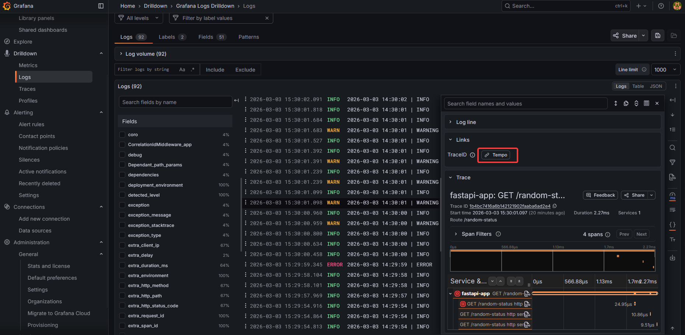
> *In Loki Explore, click the **Tempo** button next to any log line to open the full trace for that request.*

> **Trace → Logs**
> 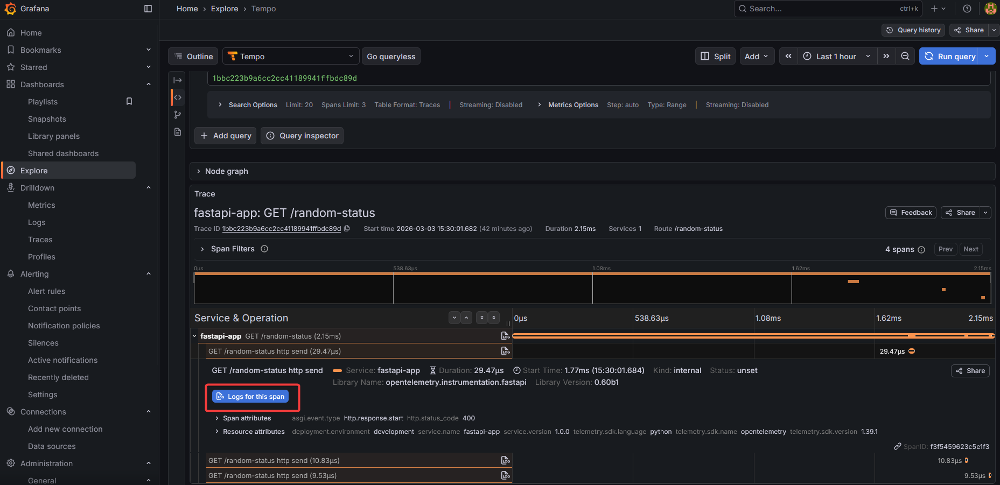
> *In a Tempo trace view, click **Logs for this span** to jump directly to the matching log lines in Loki.*

> **Metrics → Trace (Exemplars)**
> 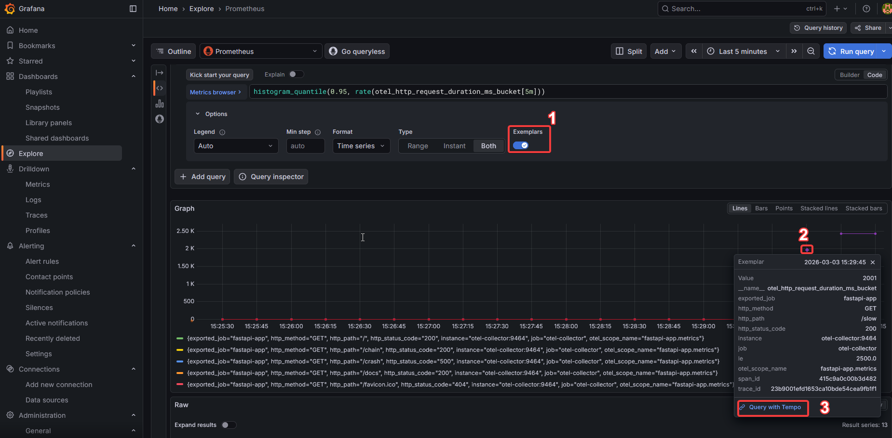
> *In a Grafana histogram panel, enable **Exemplars** (toggle), run the query — exemplar dots appear on the chart. Click a dot, then click **Query with exemplar** to open the corresponding trace in Tempo.*

---

## 📜 Make Reference

```
make help            Show all available commands
make install         Install all dependencies with uv
make sync            Re-generate uv.lock without installing
make run             Run uvicorn (production settings)
make dev             Run uvicorn with --reload (development)
make lint            Run Ruff linter
make format          Run Ruff formatter
make mypy            Run Mypy type checking
make pre-commit      Run all pre-commit hooks
make docker-up       Start full observability stack
make docker-down     Stop all containers (keep volumes)
make docker-purge    Stop all containers and delete volumes
make docker-build    Rebuild Docker images
make docker-logs     Tail all container logs
make docker-restart  Restart all containers
make clean           Remove Python cache files
```

---

## 🔧 Troubleshooting

### Telemetry not appearing in Grafana

| Symptom                 | Likely cause              | Fix                                                                                            |
| ----------------------- | ------------------------- | ---------------------------------------------------------------------------------------------- |
| No traces in Tempo      | `OTEL_ENABLED` is `false` | Set `OTEL_ENABLED=true` in your `.env`                                                         |
| No traces in Tempo      | Wrong collector endpoint  | Confirm `OTEL_EXPORTER_OTLP_ENDPOINT=localhost:4317` (local) or `otel-collector:4317` (Docker) |
| Grafana shows "No data" | Wrong time range          | Set the Grafana time picker to **Last 15 minutes** and confirm traffic was generated           |

### Containers fail to start

```bash
# See which container is unhealthy
docker compose ps

# Check a specific container's logs
docker compose logs otel-collector
docker compose logs loki
```

**Common causes:**
- **Port conflict** — ports `3000`, `4317`, `9090`, `3100`, `3200` must be free. Check with `netstat -ano | findstr :<port>` (Windows) or `lsof -i :<port>` (macOS/Linux).
- **Docker Desktop not running** — ensure Docker Desktop is started before `make docker-up`.
- **Stale volumes** — after a config change, run `make docker-purge` then `make docker-up` for a clean state.

### App starts but reports no telemetry

```bash
# Confirm OTEL_ENABLED is true inside the running container
# macOS / Linux
docker compose exec fastapi-app env | grep OTEL
# Windows (PowerShell)
docker compose exec fastapi-app env | Select-String OTEL

# Watch the collector logs for incoming spans/metrics/logs
docker compose logs -f otel-collector
```

If the collector receives data but Tempo/Loki/Prometheus do not, the issue is in the collector's exporter config (`docker/otel-collector-config.yml`).

---

## 📚 Further Reading

**OpenTelemetry**
- [OpenTelemetry Python SDK](https://opentelemetry-python.readthedocs.io/en/latest/) — official SDK docs (traces, metrics, logs)
- [OpenTelemetry Collector Contrib](https://github.com/open-telemetry/opentelemetry-collector-contrib) — all receivers, processors, and exporters
- [W3C Trace Context — traceparent spec](https://www.w3.org/TR/trace-context/) — the propagation format used by [`HTTPXClientInstrumentor`](https://pypi.org/project/opentelemetry-instrumentation-httpx/)

**Observability Stack**
- [Grafana Tempo](https://grafana.com/docs/tempo/latest/) — distributed tracing backend: storage, TraceQL, and retention config
- [Grafana Loki](https://grafana.com/docs/loki/latest/) — log aggregation backend: stream labels, structured metadata, and LogQL
- [Grafana Loki — OTLP ingestion](https://grafana.com/docs/loki/latest/send-data/otel/) — how Loki maps OTLP log attributes to stream labels and structured metadata
- [Grafana provisioning](https://grafana.com/docs/grafana/latest/administration/provisioning/) — how dashboards and datasources are auto-configured from files
- [Prometheus](https://prometheus.io/docs/introduction/overview/) — metrics storage, PromQL reference, and exemplar support

**Libraries used**
- [Loguru](https://loguru.readthedocs.io/en/stable/) — structured logging for Python
- [FastAPI](https://fastapi.tiangolo.com/) — web framework
- [uv](https://docs.astral.sh/uv/) — Python package manager used in this project

---

## 🤝 Feedback & Contributing

Found a bug, have a question, or want to share feedback? Feel free to [open an issue](https://github.com/mouakos/fastapi-monitoring-observability/issues) or [start a discussion](https://github.com/mouakos/fastapi-monitoring-observability/discussions).

If you want to contribute:

1. Fork the repository
2. Create a feature branch: `git checkout -b feat/your-feature`
3. Make your changes and ensure all checks pass: `make lint && make mypy`
4. Commit with a clear message and open a pull request against `main`

Please keep PRs focused — one feature or fix per pull request.

---

## 📄 License

This project is licensed under the [MIT License](LICENSE).

---

<div align="center">

Built by [Stephane Mouako](https://github.com/mouakos)

</div>


